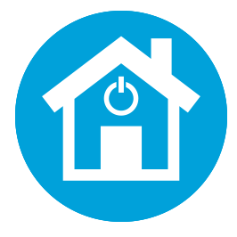

# Zwave&BLEHomeAutomationProject 
## Contenidos
- [Descripción](#descripción)
  - [Tecnologías empleadas](#tecnologías-empleadas)
- [Instalación](#instalación)
  - [Prerequisitos](#prerequisitos)
  - [Clonar repositorio](#clonar-repositorio)
  - [Instalar las dependencias necesarias](#instalar-las-dependencias-necesarias)
  - [Ejecutar la aplicación](#ejecutar-la-aplicación)
- [Contribuidores](#contribuidores)
- [Agradecimientos](#agradecimientos)


## Descripción
Se trata de un projecto capaz de captar, gestionar y almacenar datos que provienen de sensores que hacen uso de protocolos de comunicación Z-Wave y Bluetooth utilizando una Raspberry PI como controlador. Para ello, se dispone de una interfaz gráfica donde poder consultar las mediciones realiadas por los diferentes sensores, ademas de obtener las últimas muestras captadas por cada sensor en tiempo real.   

### Tecnologías empleadas
Node.js, MongoDB, OpenZWave, Bluetooth.

## Instalación

### Prerequisitos
- Node.js
- npm
- MongoDB
- Bluetooth 

  - Ubuntu, Raspbian, Fedora
    ```
    sudo apt-get install bluetooth bluez libbluetooth-dev libudev-dev
    ```
    > Nota: Asegurarse de que node está añadido al PATH.
  - Windows
    - Instalar desde una consola con permisos de administrador:
    ```
    npm install --global --production windows-build-tools
    ```
    - Usar un driver compatible con [Bluetooth 4.0](https://github.com/abandonware/node-bluetooth-hci-socket#windows).
    - Para cambiar de driver usar la herramienta [Zadig tool](https://zadig.akeo.ie/)
      
- OpenZWave

  - Ubuntu, Raspbian, Fedora
    - Hay dos formas de hacerlo tal y como se muestr en el siguiente [enlace](https://github.com/OpenZWave/node-openzwave-shared/blob/master/README-raspbian.md)
    
     > Nota: se recomienda seguir el segundo método para versiones de procesador ARMv7 o superior.
  - Windows
    - Para instalar OpenZWave en Windows, al instalar el módulo correspondiente a través del gestor de paquetes de Node.js, este se descargará, compilará e instalará automáticamente.

### Clonar repositorio
  ```
  git clone https://github.com/danelo11/HomeAutomationProject.git
  ```
  
### Instalar las dependencias necesarias
  ```
  npm install
  ```
  
### Ejecutar la aplicación
  Para ejecutar la aplicación junto con el programa principal *zwave.js* para la captación de mediciones de los sensores Z-Wave:
  ```
  npm run dev
  ```
  Para lanzar el archivo de configuración *bluetooth.js*
  ```
  node bluetooth.js
  ```

## Contribuidores
- Danel Lorente Morente - [*d.lorente@opendeusto.es*](https://www.google.es/) - [danelo11](https://github.com/danelo11/)

## Agradecimientos
- Librería para Node.js de código abierto [OpenZWave](https://github.com/OpenZWave/node-openzwave-shared).
- Librería de codigo abierto [noble](https://github.com/abandonware/noble) para controlar dispositivos Bluetooth desde un módulo central.
